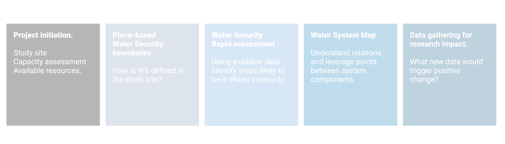
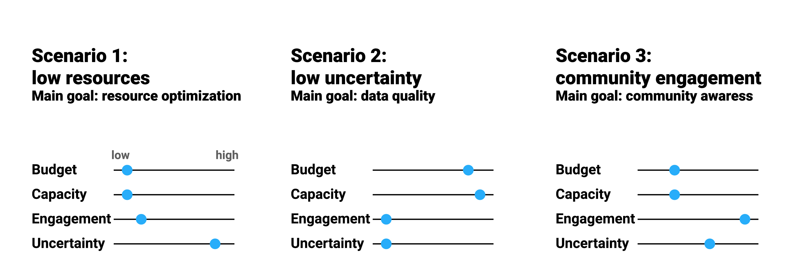

# Project initiation {#intro}

```{r , fig.align='center', out.width='90%', echo = FALSE }


```


## Concepts

The project initiation phase should gather from enough information to define the project and the essential characteristics of the study site. In particular, information should be gathered about:

### Site choice and basic characterization

The boundaries of the study area should be defined. Depending on the study scope and vision different approaches could be used ( hydrological, political, ecological). Some classification frameworks: @Rosgen1994 @UNEP2017]


### Project resources 

Several assessment tool exist [link].\
In relation to data gathering four dimensions are proposed as a starting point: budget, capacity, level of engagement with the community and level of data uncertainty.

**Budget**. Understanding available budget for the task (and its allocation across different expenditure types) is an essential information in planning an appropriate strategy. 

**Capacity** could be assessed with a particular focus on methods that could be used for data acquisition. This could include field sampling techniques, laboratory analysis, skills in geospatial and remote sensing disciplines, hydrological modelling, statistical and numerical methods.


### Stakeholder engagement

**Community engagement**. An important factor that is gaining recognition is the involvement of communities in environmental monitoring. This approach is able to produce, even with limitations, not only robust data but also increase awareness and improve people behaviours toward the environment.

### External data requirements

When gathering data to be reported to an already established framework/legislation, minimum data requirements may exist (number of data points, level of uncertainty).


### Initial condition scenarios


To simplify all the possible combination amongst the aforementioned factors and reach some level of generalization in the following step, three scenarios are proposed. Their aim is to describe some common situations 

**Scenario 01: low resources** – In this alternative, low financial resources are assumed. Methods are chosen based on cost. A medium to high level of capacity is assumed.

**Scenario 02: low uncertainty** – This scenario aims at reducing the uncertainty of sampling and analysis. Nevertheless a trade-off with cost and resources needs to be found.

**Scenario 03: Participation of local communities** Simpler methods involving citizen science and monitoring are used. More frequent, cheaper, less accurate monitoring and sampling are preferred.

```{r , fig.align='center', out.width='80%', echo = FALSE }


```


## Tools


### **Checklist** 


Below a checklist of essential information is shown.


```{r , tidy=FALSE, echo=FALSE, message=FALSE, warning=FALSE}
library(magrittr)
library(kableExtra)
data <- read.csv("./data/initiation_checklist.csv")
knitr::kable(
  head(data,26), 
  caption = 'Checklist for initiation phase ',
  booktabs = TRUE) %>% 
  kable_styling(font_size = 12, position="left")%>%
  scroll_box( height = "250px")


```


### Resources:

An initial set of tools is shown below.  New can be added at [this link](https://docs.google.com/spreadsheets/d/1xHPUe72Uhjl5YdRUlw34hEvQ-Wdnxu6dpPtXX85ZuNk/edit?usp=sharing)

```{r , tidy=FALSE, echo=FALSE, message=FALSE, warning=FALSE}
library(magrittr)
library(kableExtra)
data <- read.csv("./data/tools.csv")
sta <- subset(data, Chapter==" 1 Project initiation")
knitr::kable(
  head(data[, 1:3],26), 
  caption = 'Checklist for initiation phase ',
  booktabs = TRUE) %>% 
  kable_styling(font_size = 12, position="left")%>%
  scroll_box( height = "250px")


```

## An example

**To do:** Add report basedon hypothetical project on Akaki river basin.
