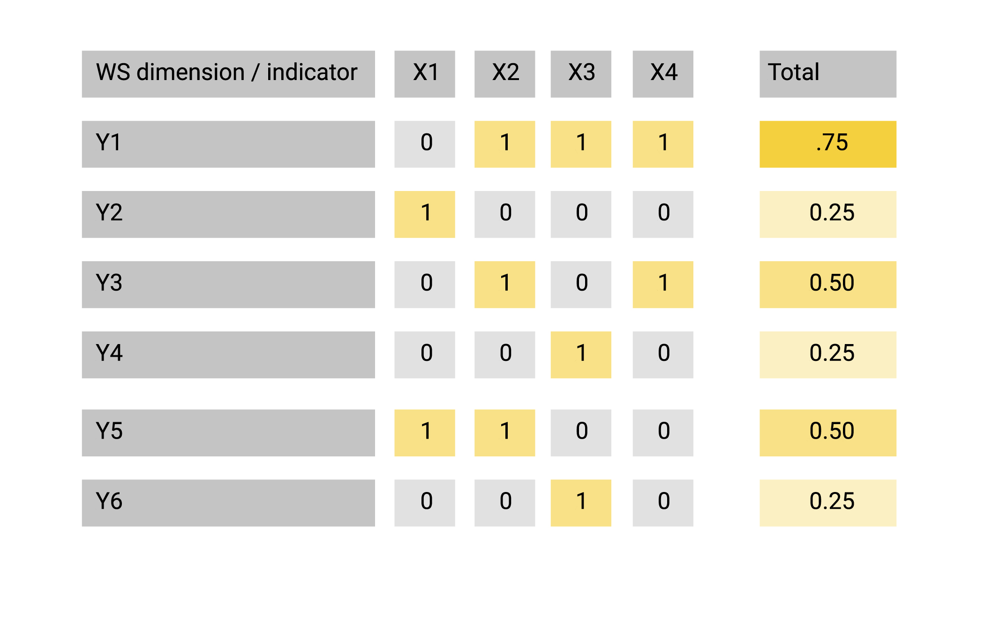

# WS boundaries {#boundaries}

## Concepts

Add link to other document/page explaining WS.

To assess  WS it is necessary to define its boundaries across four categories: dimensions, sub-dimension, indicator and parameters. The diagram below shows what would be included in the forementioned categories to assess water quality dimension. Three sub-dimension are commonly used (treated wastewater, groundwater quality, surface water quality). Each subdimension is connected to an indicator that require specific parameters to be quantified. 

```{r Water Security, echo=FALSE, message=FALSE, warning=FALSE,out.width='80%',}

dir <- getwd()
setwd(dir)
WS <- read.csv("./data/WQ_parameters.csv", fileEncoding="UTF-8-BOM")


library("collapsibleTree") 
p <- collapsibleTree( WS, c("Dimension", "Subdimension", "Indicator", "Parameter"),collapsed = FALSE, zoomable = FALSE)
p

```

Different WS indexes were considered. The most common dimensions / indicators / parameters were chosen to form the assessment grid. See below for a practical example on Akaki river.

```{r , fig.cap = "_ To select a set of WS dimension, indicators, parameters (Y), their presence is assessed in existing indexes (X1,X2,..) and ranked based on frequency._ ", fig.align='center', out.width='40%', echo = FALSE }


```


## Tools


## An example: WQ for Akaki river


### Identifying sub-dimension for Water Quality {#subdimension}

Water quality was taken as an example on how to determine indicators for a given dimension. Five different indexes were compared (ADB, 2013; Babel and Shinde, 2013; Carden and Armitage, 2013; Hofste et al., 2019; Mason and Calow, 2012; UN-EP-DHI and UNEP, 2016) within the water quality dimension (Table 2). The comparison showed that the selected indicators indicators converge to three distinct areas: assessment of river water quality (WQ01), groundwater quality (WQ02) and amount of treated discharge to the environment (WQ03). At a more detailed level, the indexes often use different parameters or methods. 


```{r , tidy=FALSE, echo=FALSE, message=FALSE, warning=FALSE}
library(magrittr)
library(kableExtra)
data <- read.csv("./data/WQ_indicators.csv")
knitr::kable(
  head(data,12), 
  caption = 'comparison of indicators used in different WS indexes to assess water quality. ',
  booktabs = TRUE) %>% 
  kable_styling(font_size = 8)


```


Three sub-dimension were identified: river water health (WQ01), groundwater quality (WQ02), treated wastewater (WQ03).For each identified subdimension, a similar approach as previously adopted was carried to identify which parameters are more suitable to be used.
