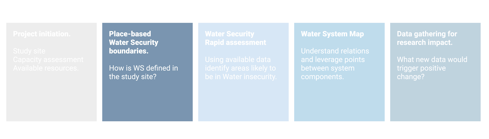
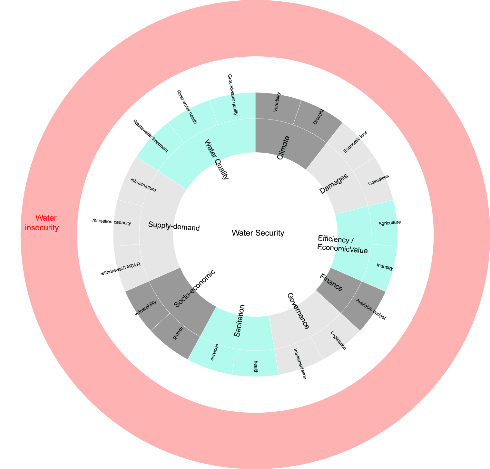

# WS boundaries {#boundaries}

```{r , fig.align='center', out.width='90%', echo = FALSE }


```

## Concepts

### Water Security

At a theoretical level, different definitions for Water Security (WS) exists and generally revolve around four main themes: water availability, human vulnerability to hazard, human needs and sustainability [@Cook2012]. One of the most used definition defines WS as: "the reliable availability of an acceptable quantity and quality of water for health, livelihoods and production, coupled with an acceptable level of water-related risks" [@Grey2007]. No globally accepted dentition exist due to the complexity of WS and to the diversity of contexts that can be found around the globe.

At an operational level, several tools exist to assess WS and water vulnerability [@Plummer2012]. Ws is usually divided into dimensions and sub-dimension (water resources, economics, institutions, social, physical environment) with associated indicators.Tools have been created for specific aspects of WS such as scarcity [@Brown2011], for  freshwater [@Norman2013], for specific geographical context such as small islands [@Holding2016Risk], for different geographical scales. 

In the diagram below we can observe that WS is divided into ten dimension (water quality, climate...). In the case of water quality, three sub-dimension exists: wastewater, groundwater (GW) and surface water quality. In this case each sub-dimension is assessed using one parameter (% of treated discharges, GW quality and surface water quality). in the last column parameters that could be used for each indicator are shown.


```{r Water Security, echo=FALSE, message=FALSE, warning=FALSE,out.width='80%',}

dir <- getwd()
setwd(dir)
WS <- read.csv("./data/WQ_parameters.csv", fileEncoding="UTF-8-BOM")


library("collapsibleTree") 
p <- collapsibleTree( WS, c("Dimension", "Subdimension", "Indicator", "Parameter"),collapsed = FALSE, zoomable = FALSE)
p

```


### A place-based WS definition

Since no universal definition and assessment tool exist, there is a need to approach WS from a place-based (and time-based) perspective. The proposed process suggests to start looking at existing tools and understanding what dimension, subdimension and indicators could be used. The choice of parameters is left for a later stage of the process.

The following table shows the dimension and indicators used across some WS indexes [ @Vorosmarty2010b; @Gain2016a; @Lautze2014; @Mason2012; @ADB2013; @Gassert2014Aqueduct] and SDGs 6 and 11. 


```{r , tidy=FALSE, echo=FALSE, message=FALSE, warning=FALSE}
library(magrittr)
library(kableExtra)
WS <- read.csv("./data/WS_dimension_format.csv")
knitr::kable(
  head(WS,70), 
  caption = 'List of dimensions and indicators used in different assessment tools with frequency of usage.',
  booktabs = TRUE) %>% 
  scroll_box(width = "100%", height = "300px")%>%
  kable_styling(font_size = 10) 


```


At the end of this step, a suitable set of dimension, sub-dimension (with associated thresholds for Water Security) should be identified. 

```{r , fig.align='center', out.width='90%', echo = FALSE }


```

## Tools


## An example: WQ for Akaki river


### Identifying sub-dimension for Water Quality {#subdimension}

Water quality was taken as an example on how to determine indicators for a given dimension. Five different indexes were compared (ADB, 2013; Babel and Shinde, 2013; Carden and Armitage, 2013; Hofste et al., 2019; Mason and Calow, 2012; UN-EP-DHI and UNEP, 2016) within the water quality dimension (Table 2). The comparison showed that the selected indicators indicators converge to three distinct areas: assessment of river water quality (WQ01), groundwater quality (WQ02) and amount of treated discharge to the environment (WQ03). At a more detailed level, the indexes often use different parameters or methods. Three sub-dimension were identified with associated indicators:\

**Dimension**: Water Quality

**Sub-dimensions:**

- surface water quality (WQ01) assessed using a suite of parameters that needs to be determined based on the project. 
- groundwater quality (WQ02) assessed using a suite of parameters to be determined based on the project.

- Discharges to the environment assessed as the fraction of untreated wastewater (WQ03).

**Threholds for Water Security**:

WQ01 - surface water: to be determined using an existing River Water Quality Index

WQ02 - Groundwater quality: to be determined using an existing Groundwater Quality Index

WQ03 - 100% of wastewater is treated before being discharged. As a second step, national regulation on discharges should be met for >80% of cases.As a third step, 100% of wastewater are treated and complly with national regulation on discharges.


```{r , tidy=FALSE, echo=FALSE, message=FALSE, warning=FALSE}
library(magrittr)
library(kableExtra)
data <- read.csv("./data/WQ_indicators.csv")
knitr::kable(
  head(data[,2:4],12), 
  caption = 'comparison of indicators used in different WS indexes to assess water quality. ',
  booktabs = TRUE) %>% 
  kable_styling(font_size = 8)


```


