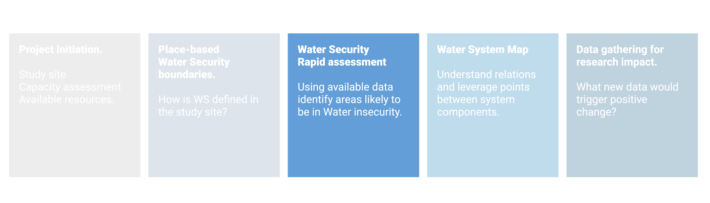
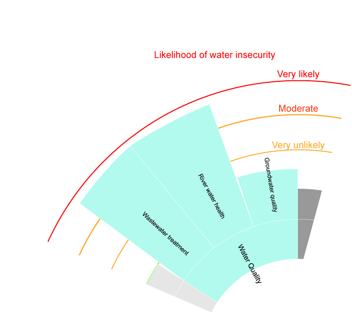

# Water Security rapid assessment 

```{r , fig.align='center', out.width='90%', echo = FALSE }


```

## Concepts

The previously identified WS dimension and sub-dimension should be assessed using available data (global datasets, peer-reviewed literature, government and NGO reports, local knowledge).


## Tools

Add global datasets

## An example

The rapid assessment was done on Akaki river WQ. Published literature suggest that anthropogenic activities contaminate river water at a microbial and chemical level. Recent increase in urbanization and industrialization created new human activities with pollution potential. In most cases the wastewater discharges are not treated before reaching the environment. The possible causes could be a lack of environmental awareness coupled with low enforcement of discharge regulation. 
The poor condition of water has negative effects on river ecosystem. Spatial (upstream and downstream,  and between Little and Great Akaki) and temporal (dry and wet season) variability exist. The reuse of river water for irrigation contaminates crop (coliform, helminth, heavy metals) and soil. Exposure to polluted water has also a negative impact on exposed communities such textile workers and river nearby inhabitants. Groundwater usage should be monitored closely because its recent increase in extraction may cause altern flow direction and cause infiltration of river water. Specific findings are shown in the figure below. Consult the supporting documentation for further references.

```{r , fig.align='center', out.width='60%', echo = FALSE, fig.cap="Water Quality subdimension are assessed for likelihood of being in a state of water insecurity" }


```

