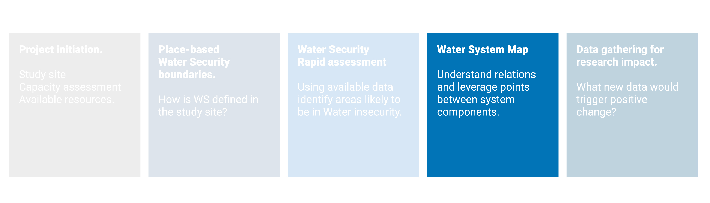
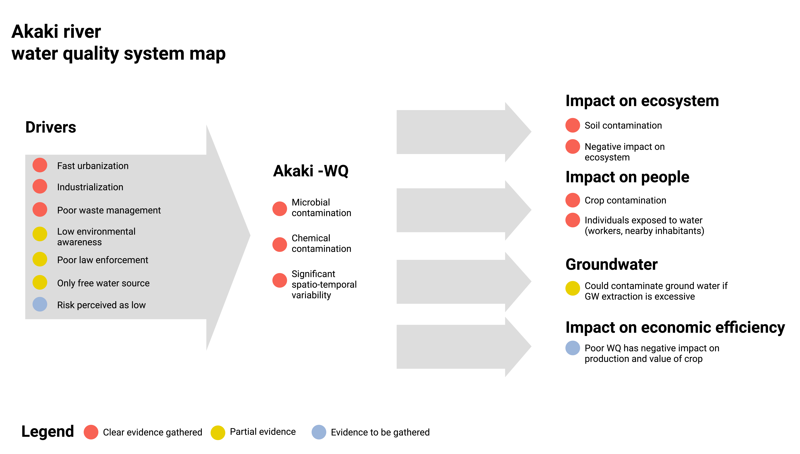

# Water Security system map

```{r , fig.align='center', out.width='90%', echo = FALSE }


```

## Concepts

Need to introduce System Approach.\
How to create a system map based on available information.\
Underline importance of  Research gaps x research need = research impact\

## Tools

## An example


```{r , fig.align='center', out.width='70%', echo = FALSE, fig.cap="Findings were used to map the Water Quality system for Akaki river basin" }


```
