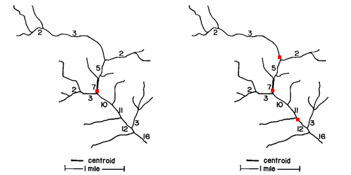

# Data gathering strategy 


## Concepts

The data gathering process was divided into three sets of decision: where  (Location), when  (Frequency) and what to sample (Parameter). Additionally available resources ( budget, time, capacity, access) should be considered. In the example,  
In the following paragraphs, an incremental approach is suggested with different approaches based on available data. 

Another important 

### Location 

The choice of sampling location can be determined based on the available information. The incremental approach proposed develops on three levels (L1,L2,L3)


**L1: Topological approach** – The choice of sampling location is one of the first decision to be taken. In case of no prior information the topological approach developed by @Sharp1971. This method allows to optimize network coverage and sampling points with only the network topology.  Each section of the river is numbered based on the number of tributaries (or sources) that is receiving. Applying this procedure to a network creates a magnitude value for each segment. Centroid position can defined as the segment nearest to $M_o/2$, where $M_o$ is the magnitude at the outlet. This step can be repeated several to meet a desired number of sampling locations (figure \@ref(fig:sharp01)). 

It is recommended to sample after full water mixture, a distance from tributaries connection of L=25 x width can be taken as general reference [@Alilou2019]. 


```{r sharp01, fig.cap = "_Figure 1: assigning a magnitude value for each segment based on its tributaries. The centroid is located (left image)at the nearest segment of $M_o/2$. In this case segment with magnitude 7, since 16/2=8. The network would be divided into two segments of magnitude 7 and 9 (given by 16-7). With the same procedure the following sampling points would be determined near the half magnitude of each segment (on the right)_ . Source: @Sharp1971", fig.align='center', out.width='60%', echo = FALSE }


```
\

**L2: Weighted topological approach based on land cover** – After the first draft of ideal location points, new knowledge can be incorporated in form of expert opinion, published literature, national data. The topological approach was improved by associating weight to each river segment [@Sanders1983; @Rajagopal1983 ].

\

**L3 incorporating published literature** – Data from published studies [@Akalu2011; @Melaku2007; @Kassegne2019;@Weldegebriel2012]. (Figure 8.4)  was used to update the map (Figure 8.5) by ranking the river segments based on risk likelihood. Likelihood was calculated as assumed water quality x presence of farming activities. Note that farming was only assessed as presence/absence and size of farmed land was not considered.

\

**L4 using geo-statistical tools** – Moving towards more sophisticated methods, kriging, genetic algorithm, conditional entropy could be included (Jiang et al., 2020; Karamouz et al., 2009) as well as Bayesian approaches (Scientific Advisory Board-Ecological Processes Standing Committee (EPSC), 2014). This would require initial data from existing stations and a higher capacity for calculations.


### Frequency

Frequency of sampling is likely to be determined by project timeline and budget. Despite this limitation, some considerations can be made. 

**F1 minimum requirement** – A bare minimum could consist in one sample per location per climatic season. 

**F2 minimum international standard** – The program GEMS/WATER recommends for streams an optimal of 24 samples per year (with a minimum of 4) and a minimum of 12 and maximum of 24 for large drainage areas of rivers (100,000 km2). 

**F3 frequency for hypothesis testing** – Once previously published data is incorporated, sampling number and frequency can be adjusted to detect a specific margin or trend. For a given confidence ($Z_α/2$), previously calculate mean (µ) and variance (σ) and confidence interval width ($µ-x$) [@Sanders1983][eq. 5.7] Sanders (1983 eq. 5.7; @Sanders1978 Sanders and Adrian, 1978) proposes the following:

$$n≥\left(\frac{Z_{α/2}\times σ}{μ-x}\right)^2$$

For time series a quantification of samples that assumes concentrations to be random, independent and identically distributed would be calculated as (Strobl and Robillard, 2008): 

$$N=[(t_{α/2} S / R)]\times2$$ 

Where N is the number of equally (temporally) spaced samples collected per year; tα/2 is a constant which is a function of the level of significance, and the number of samples; S is the standard deviation of the water quality concentrations; and R is the specified half-width of the confidence interval of the annual mean. 
More sophisticated statistical tools can be used including harmonic, Bayesian analysis, entropy, semivariogram (Khalil and Ouarda, 2009).

### Parameters

## Tools


## An example

### Location


### Frequency


### Parameters

In a previous step, water quality subdimension and indicators were identified [subdimension]. Using published literature, parameters for each subdimension were defined as follows.

**WQ01: parameters used for river water health assessment.** To better understand the range of possible parameters, a comparison was carried across previously published studies (Banda and Kumarasamy, 2020; Keraga et al., 2017; Melaku et al., 2007; Troyer et al., 2016; Worako, 2015; Yilma et al., 2018; Zotou et al., 2018). Additionally, five studies were found to use macroinvertebrate indexes to assess water quality (Akalu, S., Mengistou, S., and Leta, 2011; Aschalew and Moog, 2015; Beyene et al., 2009; Desalegne, 2018; Kebede et al., 2020). Table 3 shows the result of the analysis. The number of parameters used ranged from a minimum of 7 to maximum of 36. Overall the considered studies used a total of 59 parameters and 3 macroinvertebrates indexes. A set of parameters has been used in at least half of the considered studies (frequency >7): pH,DO,EC,Temp,NO3, BOD5, NH3, PO4.

```{r , tidy=FALSE, echo=FALSE}
library(magrittr)
library(kableExtra)
WQ01 <- read.csv("./data/WQ01_indicators.csv")
WQ01[is.na(WQ01)] <- ""

knitr::kable(
  head(WQ01,60), 
  caption = 'comparison of indicators used in different WS indexes to assess water quality. ',
  booktabs = TRUE) %>% 
  kable_styling(font_size = 8) %>%
  column_spec(2, color = "white",
              background = spec_color(WQ01[,2], end = 0.7))
```

\


**WQ02: parameters used for groundwater assessment** – The same process was followed for groundwater. Parameters used in five published studies in Ethiopia were compared (Table 4). Much more agreement between studies was found in the choice of parameters. The number of parameters used in each study varied from 13 to 16. A core dataset of twelve parameters was identified since it was used over 80% of the times.

```{r , tidy=FALSE, echo=FALSE,message=FALSE, warning=FALSE}
library(magrittr)
library(kableExtra)
WQ02 <- read.csv("./data/WQ02_indicators.csv")
WQ02[is.na(WQ02)] <- ""

knitr::kable(
  head(WQ02,16), 
  caption = 'comparison of indicators used in different WS indexes to assess water quality. ',
  booktabs = TRUE) %>% 
  kable_styling(font_size = 8) %>%
  column_spec(2, color = "white",
              background = spec_color(WQ01[,2], end = 0.7))
```


\

**WQ03 Treated wastewater** – The last indicator is usually estimated using national or municipality level available data. In some cases, a Shit Flow Analysis (sfd.susana.org) may exist. At national level, FAO estimated 0.3% of treated municipal wastewater (FAO, 2016). It the case of Addis Ababa, an estimate of 7% wastewater treatment was published by the Ministry of Water and Electricity (MoWIE, 2017).


### Proposed data gathering strategies

Summary indicating location, frequency, parameters for given scenarios.


