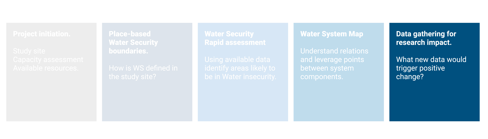
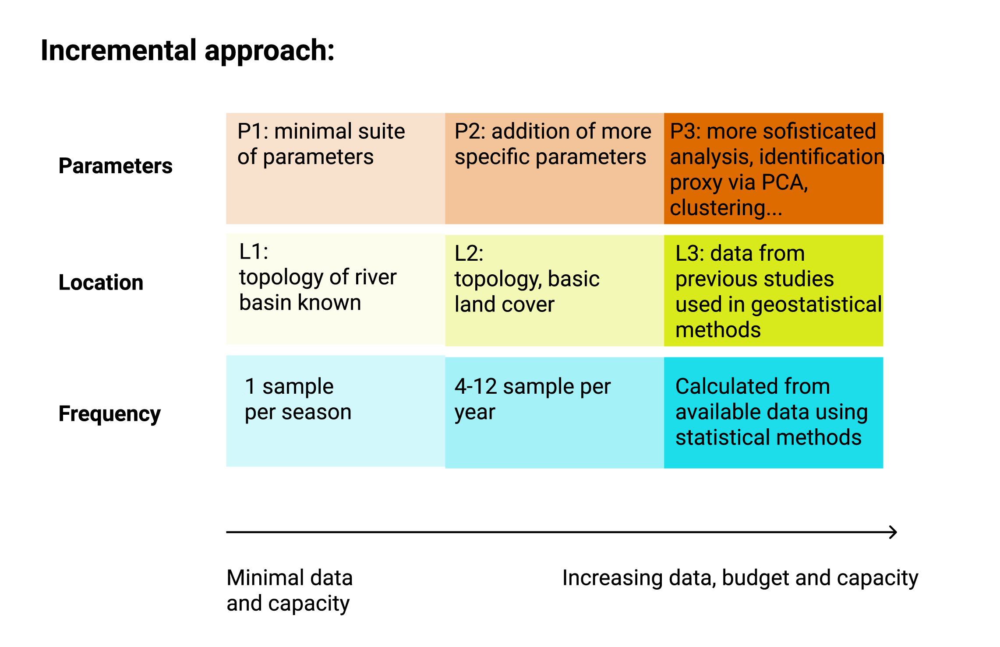

# Data gathering strategy 
```{r , fig.align='center', out.width='90%', echo = FALSE }


```


## Concepts

Previous steps should provide with an understanding of:\

- Available resources for the project\

- Level of engagement in the project for local communities, governemnt, private sector\

- WS dimension that are more likely to be in a state of insecurity\

- An understanding of the WS system (or sub-system) considered\

- Leverage points to aim at in ordert to produce positive change\

With this information in mind an initial plan for data gathering could be drafted. For specific decision on the data gathering (parameters, location, frequency) a set of different strategies based on available resources and capacity is proposed for different WS dimensions (needs to be developed). 

```{r , fig.align='center', out.width='70%', echo = FALSE, fig.cap="Diagram showing the general principle of proposing different strategies to determine specific characteristics of a new sampling (location, frequency, parameters) basedon availalbe knowledge and resources" }


```

At this stage is also worth understanding that new primary data may be meaningful only for some WS dimensions. In the following table an assessment for each WS sud-dimension:

```{r , tidy=FALSE, echo=FALSE, message=FALSE, warning=FALSE}
library(magrittr)
library(kableExtra)
data <- read.csv("./data/primary_data.csv")
colnames(data) <- c("Dimension", "Sub-dimension", "Would new primary data be meaningful?")
knitr::kable(data,
  caption = 'Assessment of Water Security sub-dimensions for suitability of new primary data gathering. ',
  booktabs = TRUE) %>% 
  kable_styling(font_size = 8)


```


### Detailing data gathering 

The data gathering process was divided into three sets of decision: where  (Location), when  (Frequency) and what to sample (Parameter). In the following paragraphs, an incremental approach is suggested with different approaches based on available data. 

#### Location 

The choice of sampling location can be determined based on the available information. The incremental approach proposed develops on three levels (L1,L2,L3)


**L1: Topological approach** – The choice of sampling location is one of the first decision to be taken. In case of no prior information the topological approach developed by @Sharp1971. This method allows to optimize network coverage and sampling points with only the network topology.  Each section of the river is numbered based on the number of tributaries (or sources) that is receiving. Applying this procedure to a network creates a magnitude value for each segment. Centroid position can defined as the segment nearest to $M_o/2$, where $M_o$ is the magnitude at the outlet. This step can be repeated several to meet a desired number of sampling locations. 


It is recommended to sample after full water mixture, a distance from tributaries connection of L=25 x width can be taken as general reference [@Alilou2019]. 


```{r sharp01, fig.cap = "_Figure 1: assigning a magnitude value for each segment based on its tributaries. The centroid is located (left image)at the nearest segment of $M_o/2$. In this case segment with magnitude 7, since 16/2=8. The network would be divided into two segments of magnitude 7 and 9 (given by 16-7). With the same procedure the following sampling points would be determined near the half magnitude of each segment (on the right)_ . Source: @Sharp1971", fig.align='center', out.width='60%', echo = FALSE }
knitr::include_graphics("images/sharp01.jpg")

```
\

**L2: Weighted topological approach based on land cover** – After the first draft of ideal location points, new knowledge can be incorporated in form of expert opinion, published literature, national data. The topological approach was improved by associating weight to each river segment [@Sanders1983; @Rajagopal1983 ].

\

**L3 incorporating published literature** – Data from published studies [@Akalu2011; @Melaku2007; @Kassegne2019;@Weldegebriel2012]. (Figure 8.4)  was used to update the map (Figure 8.5) by ranking the river segments based on risk likelihood. Likelihood was calculated as assumed water quality x presence of farming activities. Note that farming was only assessed as presence/absence and size of farmed land was not considered.

\

**L4 using geo-statistical tools** – Moving towards more sophisticated methods, kriging, genetic algorithm, conditional entropy could be included (Jiang et al., 2020; Karamouz et al., 2009) as well as Bayesian approaches (Scientific Advisory Board-Ecological Processes Standing Committee (EPSC), 2014). This would require initial data from existing stations and a higher capacity for calculations.


#### Frequency

Frequency of sampling is likely to be determined by project timeline and budget. Despite this limitation, some considerations can be made. 

**F1 minimum requirement** – A bare minimum could consist in one sample per location per climatic season. 

**F2 minimum international standard** – The program GEMS/WATER recommends for streams an optimal of 24 samples per year (with a minimum of 4) and a minimum of 12 and maximum of 24 for large drainage areas of rivers (100,000 km2). 

**F3 frequency for hypothesis testing** – Once previously published data is incorporated, sampling number and frequency can be adjusted to detect a specific margin or trend. For a given confidence ($Z_α/2$), previously calculate mean (µ) and variance (σ) and confidence interval width ($µ-x$) [@Sanders1983][eq. 5.7] Sanders (1983 eq. 5.7; @Sanders1978 Sanders and Adrian, 1978) proposes the following:

$$n≥\left(\frac{Z_{α/2}\times σ}{μ-x}\right)^2$$

For time series a quantification of samples that assumes concentrations to be random, independent and identically distributed would be calculated as (Strobl and Robillard, 2008): 

$$N=[(t_{α/2} S / R)]\times2$$ 

Where N is the number of equally (temporally) spaced samples collected per year; tα/2 is a constant which is a function of the level of significance, and the number of samples; S is the standard deviation of the water quality concentrations; and R is the specified half-width of the confidence interval of the annual mean. 
More sophisticated statistical tools can be used including harmonic, Bayesian analysis, entropy, semivariogram (Khalil and Ouarda, 2009).

#### Parameters

## Tools

Will be shown here. For suggestion refer to [this file](https://docs.google.com/spreadsheets/d/1xHPUe72Uhjl5YdRUlw34hEvQ-Wdnxu6dpPtXX85ZuNk/edit?usp=sharing)

## An example

### Location


### Frequency


### Parameters
