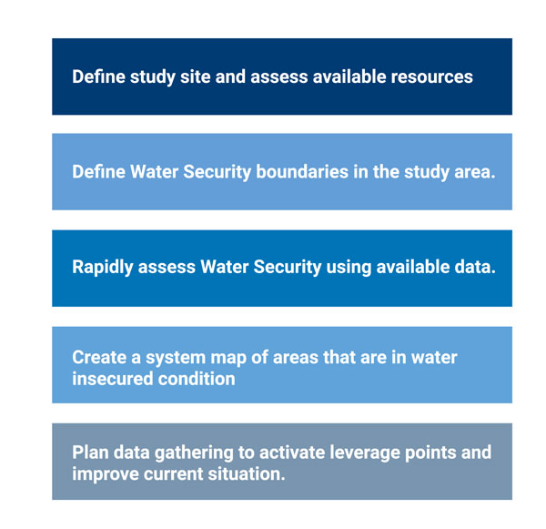

--- 
title: "Data gathering for Water Security: a contextualised approach"
author: "Giacomo Butte"
date: "`r Sys.Date()`"
site: bookdown::bookdown_site
output: bookdown::gitbook
highlight: monochrome
theme: united
documentclass: book
bibliography: [datagathering.bib, packages.bib, introduction.bib]
biblio-style: apalike
biblatexoptions: [refsegment=chapter]
link-citations: yes
github-repo: bttgcm.github.io/datastrategy
description: "A tool to plan data gathering campaign to assess Water Security"
always_allow_html: true
---


```{r,  include=FALSE}
knitr::opts_chunk$set(warning = FALSE, message = FALSE) 
```

```{r eval=FALSE, echo=FALSE}
install.packages("bookdown")
# or the development version
# devtools::install_github("rstudio/bookdown")
```


```{r include=FALSE}
# automatically create a bib database for R packages
knitr::write_bib(c(
  .packages(), 'bookdown', 'knitr', 'rmarkdown'
), 'packages.bib')
```


# Introduction


This is a guidance document for the Water Security Contextualized Assessment Tool developed within the [Water Security Hub](https://www.watersecurityhub.org) at Newcastle University. The project aim is to support decision making on data gathering by addressing the (apparently simple) question: **"What data do we need to assess Water Security?"**

The proposed process consist of several steps and each of them has a dedicated chapter.The first section of each chapter (_Concepts_) gives the a brief theoretical background, and provides reference to key ideas. The second one (_Tools_) recommends some existing tools and suggest new ones, that could support the task described inthe chapter.The third section (_An example_) shows an application of the method. 

In the case study, for simplification, a single dimension of Water Security (WS) was taken into analysis: water quality. The study site is the Akaki river basin located in Ethiopia.


## Do we need another assessment tool?


WS has emerged as a predominant framework in the assessment and understanding of the relationship between the environment and society. Past research has produced a variety of definitions, indexes,
Data and information are the foundations of any assessment of WS. 

**Place-based application** – Once operationalized, WS definitions and framing adapt to specific contexts [@Gerlak2018]. It is therefore essential to incorporate community context. Therefore, rather than a rigid set of standards and rules a method to build a data gathering strategy is suggested. The user will need to understand what boundaries, threshold, methods, risks are more relevant to the study site.


**The need for data** - Deputy Secretary-General Eliasson referred to data as the “lifeblood of decision-making and the raw material for accountability” [@UNWater2016]. Several barriers exist before reaching well-integrated, accessible and global data. Collecting data requires resources year [@Espey2015]. Data ownership, management and access add additional layer of complexity to the issue [@Hering2017]. As a consequence, data gaps still exist [@Schmidt-Traub2017b; @UNwater2019] and will affect decision-making [@York2020Measuring]. 


**The need for data gathering strategies** - When data exist, it may not necessarily translate into information. In several cases “data seems to be collected without a clear statement to be evaluated” [@Rose1992]. To reduce this possibility, it is essential to elaborate an efficient and robust data gathering strategy through careful experimental design. This aspect is not always given the right amount of attention and sampling errors “are  believed to dominate the errors of analytical measurement during the entire environmental data acquisition process” [@Zhang2012] and will produce different results [@Abbatangelo2019; @Wang2015a]. A data gathering strategy (DGS) becomes an essential activity to optimize resources, address leverage points, transform research into impact and reduce uncertainties.


## Process steps


The approach is divided into five steps:

- **Definition of study site and assessment of available resources** 

- **Boundaries definition for Water Security**
From existing WS indexes, compile a context appropriate short-list of indicators to assess different dimensions of WS.
Threshold values are usually attached to each indicator but could be revised to suit local condition. Section: [WS boundaries]. 

- **Rapid Water in-Security assessment** using available data from global datasets, published literature, local knowledge and national data. The research aims at finding evidence for likelihood of Water in-Security for a given dimension, identifying a possible hazard and possible impact. The gathered secondary data is used for a quick assessment of the different dimensions of WS.  Dimensions / sub-dimension likely of being in a water insecurity (hazard id) states are identified for additional primary data gathering. Section: [Water Security rapid assessment]

- **System mapping.**The previously identified WS dimension in a possible state of Water inSecurity are analysed as systems. Determining causes and impacts of water insecurity are identified. Comparison with available data allows for the identification of knowledge gaps and possible leverage points to move the WS dimension into a state of water security.

- **Data gathering for research for impact**. The previous analysis allows to identify research areas that could lead to larger impact in the improvement of water security. This could involve better spatio-temporal characterization, risk assessment, forecasting, identification of mitigation practices. Particularly attention should be given to the communication of findings to relevant stakeholders 


```{r process diagram, fig.cap = "_Proposed process to create a data gathering strategy_ ", fig.align='center', out.width='40%', echo = FALSE }


```

