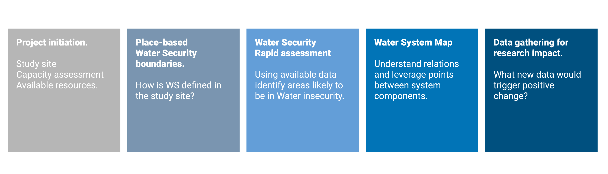

--- 
title: "Data gathering for Water Security: a suggested process"
#author: "WP 3.1 data team"
#date: "`r Sys.Date()`"
cover-image: cover.jpg
site: bookdown::bookdown_site
output: bookdown::gitbook
highlight: monochrome
theme: united
documentclass: book
bibliography: [datagathering.bib, packages.bib, introduction.bib,initiation.bib]
biblio-style: apalike
biblatexoptions: [refsegment=chapter]
link-citations: yes
github-repo: bttgcm.github.io/datastrategy
description: "A tool to plan data gathering campaign to assess Water Security"
always_allow_html: true
---


```{r,  include=FALSE}
knitr::opts_chunk$set(warning = FALSE, message = FALSE) 
```

```{r eval=FALSE, echo=FALSE}
install.packages("bookdown")
# or the development version
# devtools::install_github("rstudio/bookdown")
```


```{r include=FALSE}
# automatically create a bib database for R packages
knitr::write_bib(c(
  .packages(), 'bookdown', 'knitr', 'rmarkdown'
), 'packages.bib')
```

Updates 
here


# About {-}

This is a guidance document for the Water Security Contextualized Assessment Tool developed within the [Water Security Hub](https://www.watersecurityhub.org) at Newcastle University. [Separate documents](https://drive.google.com/drive/folders/1NTrfXlcbLm1Vl83p9Je2v3TI5qGHl-Qd?usp=sharing) illustrates methods and additional literature reviewed in this project . 

**Feedback**
The document is open to feedback and suggestions.\
For general comments you may use [<mark> this form</mark> ](https://forms.gle/pKUkQ4EF2kdGTpE98) \
For specific comments you may edit the text files that contain the guidance and the [<mark> additional documentation here</mark>](https://drive.google.com/drive/folders/1NTrfXlcbLm1Vl83p9Je2v3TI5qGHl-Qd?usp=sharing)


**Updates**

22-31.01.2021 - Draft improved in order to be presented to Hub members for feedback

22.1.2021 - Initial draft uploaded on Github and online.

# Introduction

The project aim is to support decision making on data gathering by addressing the (apparently simple) question: **"What data do we need to assess Water Security?"**

The proposed process should be understood as a suggested pathway, consisting of several steps. Each step dedicated chapter.The first section of each chapter (_Concepts_) gives the a brief theoretical background and provides reference to key ideas. The second one (_Tools_) recommends some existing tools, methods and suggest possible future research  that could support the task described in the chapter.The third section (_An example_) shows an application of the method. 

In the case study, for simplification, a single dimension of Water Security (WS) was taken into analysis: water quality. The study site is the Akaki river basin located in Ethiopia.


## Process steps


The approach is divided into five steps:

- **Project initiation** A study site is chosen and defined. Available capacity and resources should be assessed. The informatino gatherd at this stage will be used to tailor decisions inthe following step and provide a strategy that is suitable to the given situation ( in term of time, capacity, budget, access to site,..).

- **Place-based Water Security boundaries**
From existing WS indexes, compile a context appropriate short-list of indicators to assess different dimensions of WS.
Threshold values are usually attached to each indicator but could be revised to suit local condition. Section: [WS boundaries]. 

- **Water Security rapid assessment** using available data from global datasets, published literature, local knowledge and national data. The research aims at finding evidence for likelihood of Water in-Security for a given dimension, identifying a possible hazard and possible impact. The gathered secondary data is used for a quick assessment of the different dimensions of WS.  Dimensions / sub-dimension likely of being in a water insecurity (hazard id) states are identified for additional primary data gathering. Section: [Water Security rapid assessment]

- **Water system map**The previously identified WS dimension in a possible state of Water inSecurity are analysed as systems. Determining causes and impacts of water insecurity are identified. Comparison with available data allows for the identification of knowledge gaps and possible leverage points to move the WS dimension into a state of water security.

- **Data gathering for research for impact**. The previous analysis allows to identify research areas that could lead to larger impact in the improvement of water security. This could involve better spatio-temporal characterization, risk assessment, forecasting, identification of mitigation practices. Particularly attention should be given to the communication of findings to relevant stakeholders.


```{r , fig.cap = "_Proposed process to create a data gathering strategy_ ", fig.align='center', out.width='90%', echo = FALSE }


```


